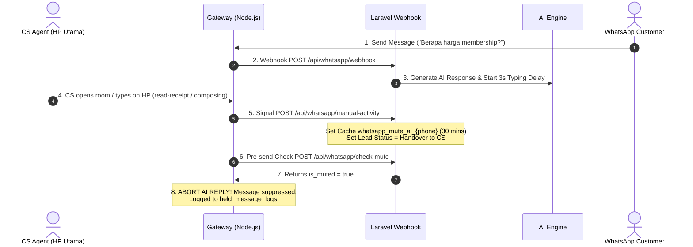

# 🤖 AI Auto-Reply Engine & CS Auto-Mute Module

This document outlines the inner workings of the AI Assistant (Loyal Fitness Knowledge Base) and the 4-layer CS Auto-Mute (Human Takeover) protection module.

---

## 🧠 AI Engine Architecture

### 1. Model & Prompting
- **Primary Engine**: OpenAI GPT-4o (`gpt-4o`) via `OpenAiService.php`.
- **System Prompt**: Customized for **Loyal Fitness Prime PS (Palembang Square)**.
- **Knowledge Scope**:
  - Pricing: Starts from **~Rp 240.000/month** (3, 6, 12 month packages).
  - Operating Hours: Mon–Sat 06:00–22:00, Sun/Holidays 08:00–20:00.
  - Facilities: Sauna, Functional Area, Cardio Zone, Free Weights, Group Classes (Zumba, BodyPump, RPM, Yoga).
  - Location: Palembang Square Mall, 2nd Floor.

### 2. Membership Consultant (MC) Handover Mapping
When a lead score reaches **>= 70%** or the user asks to speak directly with CS / register, the AI presents interactive buttons for the 5 MCs:
```php
$mcMapping = [
    'mc_1' => '62895604631765', // Popi
    'mc_2' => '6285367394199', // Ayu
    'mc_3' => '6281314420857', // Indah
    'mc_4' => '6281929924446', // Lenny
    'mc_5' => '6282160149532', // Mesi Lenny
];
```

---

## 🛑 CS Auto-Mute (Human Takeover) Module

The Auto-Mute module guarantees that whenever a human CS agent interacts with a customer via the main paired WhatsApp phone, the AI **automatically becomes idle** for **30 minutes**.



---

## 🛡️ The 4 Layers of Auto-Mute Detection

### Layer 1: Outgoing Message Detection (`fromMe`)
When `gateway.js` detects an outgoing message sent from the paired phone (`msg.key.fromMe === true`), it immediately sends a manual activity signal to Laravel.

### Layer 2: Chat Room Opened (`chats.update`)
When the CS agent clicks and opens a specific contact's chat room on the phone, Baileys emits a `chats.update` event.

### Layer 3: Presence & Typing Indicator (`presence.update`)
When the CS agent starts typing (`composing`) or recording a voice note (`recording`) on the phone, Baileys catches the presence update.

### Layer 4: Read Receipt / Centang Biru (`message-receipt.update`)
When the CS agent reads an incoming message on the phone, WhatsApp emits a read-receipt (`message-receipt.update`). This instantly triggers `handleManualActivity`, muting the AI before its typing delay timer expires.

---

## 🎛️ Controlling Mute via Dashboard

- **Viewing Held Messages**: Open `/dashboard/held-messages` to view all suppressed messages and their 30-minute expiration countdown timers.
- **Manual Restore**: Click **`Restore AI`** on any held message entry to clear `Cache::forget("whatsapp_mute_ai_{phone}")` and immediately restore AI control.
