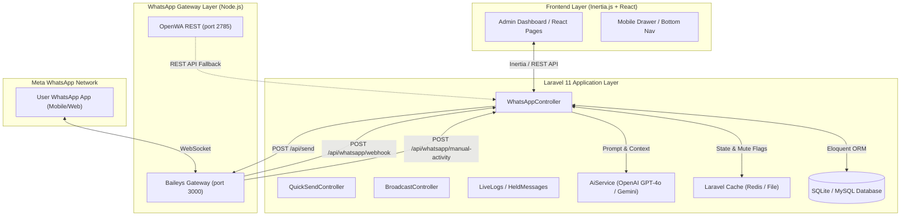

# 🏗️ System Architecture & Data Flow Blueprint

This document details the architectural design, interaction models, database schemas, and caching mechanisms used throughout **WhatsAI-CRM**.

---

## 📐 High-Level Architecture Diagram

---

## 🔄 Core Data Flow Specifications

### 1. Incoming WhatsApp Message Flow
1. **WhatsApp Network** sends a WebSocket frame to `whatsapp-gateway/gateway.js` (Baileys Engine).
2. `gateway.js` extracts sender phone number (`sender`) and text body (`message`).
3. `gateway.js` issues a `POST` request to `http://localhost:8001/api/whatsapp/webhook`.
4. `WhatsAppController@handleWebhook` receives the payload and checks:
   - Is sender currently muted via `Cache::has("whatsapp_mute_ai_{phone}")`?
   - Is Lead status set to `Handover to CS` / `Visit Scheduled` / `Closed Won` / `Closed Lost`?
5. **If Muted / Handover**: Message is recorded in `held_message_logs`, AI reply is suppressed, and JSON returns `ai_response: null`.
6. **If Active**: Lead score is calculated, `AiService` generates the GPT-4o response, and returns JSON `ai_response: "..."`.
7. `gateway.js` receives `ai_response`, simulates typing delay (`composing`), checks `/api/whatsapp/check-mute` one last time, and delivers the message via `sock.sendMessage()`.

---

## 🗄️ Database Schemas Summary

### `leads` Table
| Column | Type | Description |
|---|---|---|
| `id` | BigInt | Primary key |
| `name` | String | Lead customer name |
| `phone` | String (Unique) | Clean phone number (digits only, e.g. `628123456789`) |
| `status` | Enum | `new`, `cold`, `warm`, `hot`, `Handover to CS`, `Visit Scheduled`, `Closed Won`, `Closed Lost` |
| `lead_score` | Integer | Calculated interest score (0–100) |
| `assigned_to` | BigInt (FK) | User ID of assigned Membership Consultant |

### `conversations` Table
| Column | Type | Description |
|---|---|---|
| `id` | BigInt | Primary key |
| `lead_id` | BigInt (FK) | Relates to `leads.id` |
| `sender` | Enum | `user` (customer) or `ai` / `cs` |
| `message` | Text | Raw chat message content |

### `held_message_logs` Table
| Column | Type | Description |
|---|---|---|
| `id` | BigInt | Primary key |
| `lead_id` | BigInt (FK) | Relates to `leads.id` |
| `phone` | String | Target phone number |
| `customer_name` | String | Customer display name |
| `message` | Text | Suppressed incoming message content |
| `reason` | String | Mute trigger reason |
| `status` | Enum | `held` or `restored` |
| `muted_until` | DateTime | Expiration timestamp of the 30-min mute window |

---

## ⚡ Cache Key Reference Table

| Cache Key | TTL | Purpose |
|---|---|---|
| `whatsapp_gateway_status` | 90s | Current gateway connection status (`connected` / `disconnected`) |
| `whatsapp_gateway_qr` | 90s | Raw Baileys QR code string broadcasted by `gateway.js` |
| `whatsapp_mute_ai_{phone}` | 30m | Auto-Mute flag set when CS activity is detected on HP |
| `openwa_session_unpaired` | Permanent | Explicit unpair flag to prevent auto-reconnect loops |
